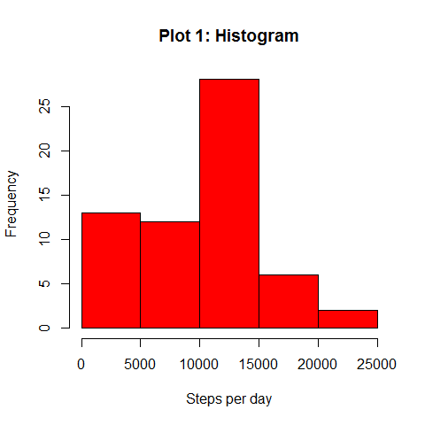
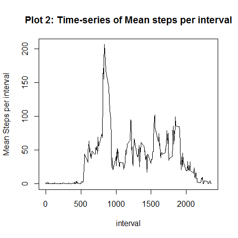
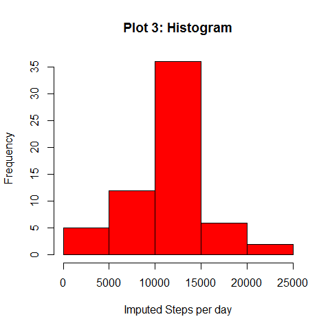
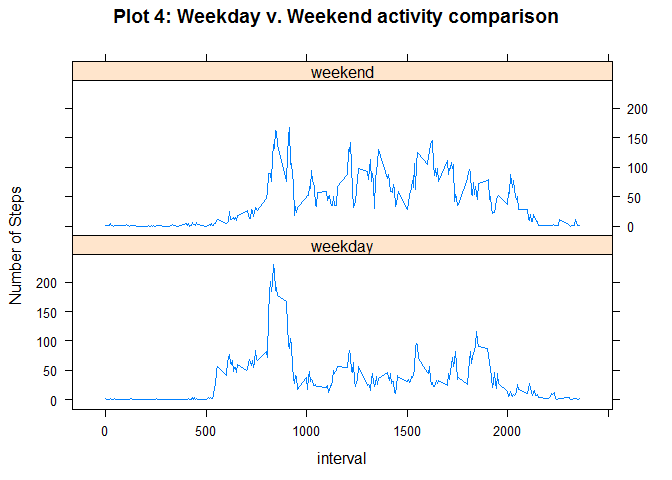

# Reproducible Research: Peer Assessment 1


## Loading and preprocessing the data

First we need to load required R packages and the data.  The warn.conflicts argument is set to FALSE to supressing warnings to make the text and code cleaner in the html document being generated.  The data needs to be unzipped.  Code below creates a temporary file to unzip the data and reads into an object named 'activity'.

Next the code chunk creates a date and time stamp.  It turned out this step was not necessary for this assignment but if an accurate date and time stamp was needed for future analysis this code creates it.


```r
        library(lubridate)
        library(lattice)
        library(dplyr, warn.conflicts=FALSE)
        
        temp <- tempfile()
        temp <- unzip("activity.zip")
        activity <- read.csv("activity.csv")
        unlink(temp)
        
        i<- 1
        while(i <= length(activity$interval)) {
        x <- nchar(activity$interval[i])
        if(x==2) {activity$interval[i] <- paste("00",activity$interval[i], sep="")}
        if (x==3){ activity$interval[i] <- paste("0",activity$interval[i], sep="")} 
        if (x==1) { activity$interval[i] <- paste ("000",activity$interval[i], sep="")}
        i<-i+1
        }
        
        activity$dt <- paste(activity$date, activity$interval)
        activity$dt <- strptime(activity$dt, "%Y-%m-%d %H%M")
        activity$date <- ymd(activity$date)
```

## What is mean total number of steps taken per day?

Code below calculates mean and median and ignores NAs.


```r
        stepsperday <- with(activity, tapply(steps, date, sum, na.rm=TRUE))
        meanstepsperday <- mean(stepsperday)
        medianstepsperday <- median(stepsperday)
        paste("Mean Steps per day:",round(meanstepsperday))
```

```
## [1] "Mean Steps per day: 9354"
```

```r
        paste("Median Steps per day:",round(medianstepsperday))
```

```
## [1] "Median Steps per day: 10395"
```

Below is the histogram of Steps per day, ignoring NAs.


```r
        hist(stepsperday, main="Plot 1: Histogram", xlab= "Steps per day", col="red")
```

 

## What is the average daily activity pattern?

To create the time series plot, the mean steps per interval across all days is computed, ignoring NAs.


```r
        stepsperinterval <- with(activity, tapply(steps, interval, mean, na.rm=TRUE))
        xx <- row.names(stepsperinterval)
        intsteps <- cbind("interval" = xx, "Mean Steps per interval" = stepsperinterval)
```


```r
        plot(intsteps, type="l", main= "Plot 2: Time-series of Mean steps per interval")
```

 

The time interval when the maximum activity (measured as number of steps) can be easily extracted by using the code chunk below.


```r
        j <- which(as.numeric(intsteps[,2])==max(as.numeric(intsteps[,2])))
        paste("Max Number Steps found in:",intsteps[j,1])
```

```
## [1] "Max Number Steps found in: 0835"
```


## Imputing missing values

The code below replaces NA (or missing values) with the mean steps for the interval calculated previously.  A new vector named 'stepsnew' is created that replaces the missing values with the imputed values.  Finally, 'activitynew', a new data frame, is created.


```r
        nas <- sum(is.na(activity$steps))
        activity$stepsnew <- seq_along(activity$interval)
        n<-1
        for (n in 1:length(activity$interval)){
          if (is.na(activity$steps[n])==TRUE) {
            activity$stepsnew[n] <- intsteps[which(intsteps[,1]==activity$interval[n]),2]
                        } else {activity$stepsnew[n] <- activity$steps[n]}
            n <- n+1 
                }                     
        activitynew <- activity
```

Using the head function,  comparing the "steps" and "stepsnew" columns one can see that the NAs have been replaced with imputed values.


```r
        head(activitynew,3)
```

```
##   steps       date interval                  dt          stepsnew
## 1    NA 2012-10-01     0000 2012-10-01 00:00:00  1.71698113207547
## 2    NA 2012-10-01     0005 2012-10-01 00:05:00 0.339622641509434
## 3    NA 2012-10-01     0010 2012-10-01 00:10:00 0.132075471698113
```

Now the mean and median steps can be calculated for the Imputed values.


```r
        stepsperdayi <- with(activitynew,tapply(as.numeric(stepsnew), date, sum, na.rm=T))
        meanstepsperdayi <- mean(stepsperdayi)
        medianstepsperdayi <- median(stepsperdayi)
```

Also, the histogram can be replotted.


```r
        hist(stepsperdayi, main = "Plot 3: Histogram", xlab="Imputed Steps per day", 
                                                                                col="red")
```

 

Comparing the mean and median values of the original dataset versus the imputed dataset, we can see that the mean and median values are now higher.  Interestingly, the mean and median values of the imputed steps coincide. Again, the values are rounded for ease of reading.


```r
        meandiff <- meanstepsperdayi - meanstepsperday
        mediandiff <- medianstepsperdayi - medianstepsperday
        x <- c(meanstepsperday, meanstepsperdayi, meandiff)
        y <- c(medianstepsperday, medianstepsperdayi, mediandiff)
        compare <- data.frame(round(x), round(y))
        colnames(compare)=c("Mean", "Median")
        rownames(compare)=c("Raw", "Imputed", "Difference")
        compare
```

```
##             Mean Median
## Raw         9354  10395
## Imputed    10766  10766
## Difference  1412    371
```


## Are there differences in activity patterns between weekdays and weekends?

A new factor variable is created to indicate "weekday" or "weekend" using the wday function from the lubridate package in R. Then a data frame, y2, is created to make the panel plot.  The variable "period" is a factor variable that labels the data as 'weekday' or 'weeekend'.


```r
        activitynew$dt <- as.Date(activitynew$dt) 
        activitynew$weekdayorend <- sapply(activitynew$dt, function (x) 
                                        ifelse((wday(x) %in% 2:6),"weekday","weekend"))
        y2<-activitynew%>%group_by(weekdayorend, interval)%>%
                                                summarise(mean(as.numeric(stepsnew)))
        colnames(y2) <- c("period", "interval", "mean_steps")
        y2$interval <- as.numeric(y2$interval)
```


Using the lattice package in R, an XYplot is created to compare the weekday average trend by time interval with that during the weekend.


```r
        xyplot(mean_steps~interval|period, y2, type="l", layout=c(1,2), 
               ylab="Number of Steps", 
               main="Plot 4: Weekday v. Weekend activity comparison")
```

 
